# Vendure 多租户使用手册

## 1. 多租户架构概述

### 1.1 Vendure Channel 机制

Vendure 通过 **Channel** 实现多租户。一个 Vendure 实例可以运行多个销售渠道，每个 Channel 可独立配置：

- 货币（defaultCurrencyCode、availableCurrencyCodes）
- 语言
- 税收规则
- 配送方式（ShippingMethod）
- 支付方式（PaymentMethod）
- 商品与价格（ProductVariant + ProductVariantPrice）
- 促销活动（Promotion）
- 管理员角色权限（Role）
- 库存位置（StockLocation）

每个 Vendure 实例都有一个 **default Channel**，包含所有实体。后续创建的 Channel 可以包含 default Channel 中实体的子集。

**Channel-aware 实体列表：**

| 实体 | 说明 |
|------|------|
| Product / ProductVariant | 商品及其规格，按 Channel 分配，支持多货币定价 |
| Collection | 商品集合 |
| Facet / FacetValue | 商品属性与属性值 |
| Asset | 图片等资源文件 |
| ShippingMethod | 配送方式 |
| PaymentMethod | 支付方式 |
| Promotion | 促销活动 |
| Order | 订单（下单时绑定当前 Channel） |
| Customer | 客户 |
| Role | 管理员角色（可限定 Channel） |
| StockLocation | 库存位置 |

### 1.2 本项目多租户架构

本项目在 Vendure 原生 Channel 基础上，通过 **cjk-plugin** 的 tenant 模块和 **VShop** 的 tenant store 实现完整的多租户方案。

```
┌─────────────────────────────────────────────────────────────┐
│                      VShop 前端                              │
│                                                             │
│  tenant store ──→ vendure-token header ──→ GraphQL Client   │
│  (租户识别)        (Channel token)          (API 请求)        │
│       ↑                                                     │
│  URL 参数 / hostname / 小程序 scene / Storage                │
└──────────────────────────┬──────────────────────────────────┘
                           │ HTTP (vendure-token header)
                           ▼
┌─────────────────────────────────────────────────────────────┐
│                    Vendure 后端                              │
│                                                             │
│  Shop API ──→ Channel 路由 ──→ Channel-aware 数据隔离       │
│                  │                                          │
│                  ├── Channel A (token: channel-a)           │
│                  │   ├── 商品/价格 (独立)                    │
│                  │   ├── 配送方式 (独立)                      │
│                  │   ├── 支付方式 (独立)                      │
│                  │   ├── 促销策略 (couponStackable 等)       │
│                  │   └── 管理员权限 (限定 Channel A)          │
│                  │                                          │
│                  ├── Channel B (token: channel-b)           │
│                  │   └── ... (独立配置)                      │
│                  │                                          │
│                  └── Default Channel (token: __default__)   │
│                      └── 包含所有实体（管理用）               │
│                                                             │
│  cjk-plugin tenant 模块:                                    │
│    ├── Channel 自定义字段 (couponStackable, maxStackableCount)│
│    ├── TenantSetupService (租户策略读写)                      │
│    ├── PickupLocation (Channel-aware 自提点)                 │
│    ├── COD 支付 (货到付款)                                    │
│    ├── 门店自提 / 自提点配送                                   │
│    └── 优惠券叠加策略 (按 Channel 配置)                       │
└─────────────────────────────────────────────────────────────┘
```

### 1.3 多租户能力矩阵

| 能力 | 实现方式 | 配置位置 |
|------|---------|---------|
| 独立商品 | Channel-aware ProductVariant | Admin UI → 商品 → 分配到 Channel |
| 多货币定价 | ProductVariantPrice（每 Channel 每货币一条） | Admin UI → 商品变体 → 价格 |
| 独立配送 | Channel-aware ShippingMethod | Admin UI → 配置 → 配送方式 |
| 门店自提 | cjk-plugin storePickup | Admin UI → 配送方式（store-pickup checker） |
| 自提点 | cjk-plugin pickupPoint + PickupLocation | Admin UI → 配送方式 + pickupLocations API |
| 独立支付 | Channel-aware PaymentMethod | Admin UI → 配置 → 支付方式 |
| 货到付款 | cjk-plugin COD handler | Admin UI → 支付方式（cash-on-delivery） |
| 优惠券叠加 | cjk-plugin couponStackableCondition | Channel 自定义字段 + Promotion 自定义字段 |
| 独立语言 | Channel defaultLanguageCode + cjk-plugin i18n | Admin UI → Channel 设置 |
| 独立管理员 | Role 限定 Channel | Admin UI → 设置 → 角色 |
| 前端模板 | VShop template registry | `src/templates/registry.ts` |
| 前端功能开关 | VShop tenant features | `src/stores/tenant.ts` TENANT_CONFIGS |

---

## 2. 运维操作指南

### 2.1 启用多租户模块

多租户的 Channel 自定义字段需要启用 cjk-plugin 的 tenant 模块。

编辑 `packages/dev-server/dev-config.ts`，将 CjkPlugin 初始化改为：

```typescript
CjkPlugin.init({
    i18n: { enabled: true },
    regions: { enabled: true },
    tenant: { enabled: true },           // 启用多租户 Channel 自定义字段
    cod: { enabled: true },              // 启用货到付款
    storePickup: { enabled: true },      // 启用门店自提
    pickupPoint: { enabled: true },      // 启用自提点
    promotionPolicy: { enabled: true },  // 启用优惠券叠加策略
}),
```

修改后重启 dev-server 即可生效。

### 2.2 创建新 Channel（租户）

#### 方式一：Admin UI 操作

1. 登录 Admin UI：`http://localhost:3000/admin`
2. 左侧菜单 → **Settings** → **Channels**
3. 点击 **Create new channel**
4. 填写信息：
   - **Code**：租户唯一标识（如 `shop-a`）
   - **Token**：API 访问 token（如 `shop-a-token`），前端通过 `vendure-token` header 传递
   - **Default currency**：默认货币（如 `CNY`）
   - **Available currencies**：可用货币列表
   - **Default language**：默认语言（如 `zh_Hans`）
5. 点击 **Create**

#### 方式二：Admin GraphQL API

```graphql
mutation CreateChannel {
  createChannel(input: {
    code: "shop-a"
    token: "shop-a-token"
    defaultCurrencyCode: CNY
    availableCurrencyCodes: [CNY, USD]
    defaultLanguageCode: zh_Hans
    availableLanguageCodes: [zh_Hans, zh_Hant, en]
  }) {
    ... on Channel {
      id
      code
      token
      defaultCurrencyCode
    }
    ... on ErrorResult {
      errorCode
      message
    }
  }
}
```

### 2.3 Channel 基础配置

创建 Channel 后，需配置货币、语言和税收。

#### 货币与语言

Admin UI → **Settings** → **Channels** → 选择 Channel → 编辑：

| 配置项 | 说明 | 示例 |
|--------|------|------|
| Default currency | 默认结算货币 | CNY |
| Available currencies | 支持的货币列表 | CNY, USD |
| Default language | 默认界面语言 | zh_Hans |
| Available languages | 支持的语言列表 | zh_Hans, zh_Hant, en |

#### 税收

Admin UI → **Settings** → **Tax Categories** → 创建税收类别。

Admin UI → **Settings** → **Tax Rates** → 按 Channel 和 Zone 配置税率。

### 2.4 按 Channel 配置配送方式

Vendure 的 ShippingMethod 是 Channel-aware 实体，每个 Channel 可独立配置配送方式。

#### 创建配送方式

Admin UI → **Settings** → **Shipping Methods** → 切换到目标 Channel → **Create new shipping method**

或通过 Admin API（需先切换到目标 Channel）：

```graphql
mutation CreateShippingMethod {
  createShippingMethod(input: {
    code: "express-delivery"
    name: "极速达"
    description: "当日送达"
    checker: {
      code: "order-total"
      arguments: [{ name: "minimum", value: "0" }]
    }
    calculator: {
      code: "shipping-by-price"
      arguments: [{ name: "rate", value: "1000" }]
    }
  }) {
    ... on ShippingMethod { id code name }
  }
}
```

#### 本项目支持的配送方式

| 配送方式 | checker code | calculator code | 说明 |
|---------|-------------|----------------|------|
| 门店自提 | `store-pickup-eligibility` | `store-pickup-calculator` | 免费，需启用 cjk-plugin storePickup |
| 自提点 | `pickup-point-eligibility` | `pickup-point-calculator` | 可配置运费，需启用 cjk-plugin pickupPoint |
| 标准快递 | Vendure 内置 checker | Vendure 内置 calculator | 按金额/重量计算 |

#### 配置自提点

自提点（PickupLocation）是 Channel-aware 实体，创建时自动绑定当前 Channel。

通过 Admin API 创建自提点：

```graphql
mutation CreatePickupLocation {
  createPickupLocation(input: {
    name: "中关村门店"
    type: "store"
    address: "北京市海淀区中关村大街1号"
    phoneNumber: "010-12345678"
    businessHours: "09:00-22:00"
    coordinates: { lat: 39.9847, lng: 116.3076 }
  }) {
    id
    name
    type
    address
  }
}
```

查询当前 Channel 的自提点：

```graphql
query {
  pickupLocations {
    items { id name type address phoneNumber businessHours }
    totalItems
  }
}
```

> PickupLocation 查询自动按当前 Channel 过滤（见 `PickupLocationService.findAll` 中的 `innerJoin('pl.channels', 'channel', 'channel.id = :channelId')`）。

### 2.5 按 Channel 配置支付方式

PaymentMethod 同样是 Channel-aware 实体。

#### 创建支付方式

Admin UI → **Settings** → **Payment Methods** → 切换到目标 Channel → **Create new payment method**

或通过 Admin API：

```graphql
mutation CreatePaymentMethod {
  createPaymentMethod(input: {
    code: "wechatpay"
    name: "微信支付"
    description: "微信扫码/JSAPI支付"
    enabled: true
    handler {
      code: "wechatpay"
      arguments: []
    }
  }) {
    ... on PaymentMethod { id code name enabled }
  }
}
```

#### 本项目支持的支付方式

| 支付方式 | handler code | 插件 | 启用条件 |
|---------|-------------|------|---------|
| 微信支付 | `wechatpay` | wechatpay-plugin | 配置 `WECHATPAY_NOTIFY_URL` |
| 支付宝 | `alipay` | alipay-plugin | 配置 `ALIPAY_NOTIFY_URL` |
| 货到付款 | `cash-on-delivery` | cjk-plugin COD | `CjkPlugin.init({ cod: { enabled: true } })` |
| 余额支付 | `balance-pay` | recharge-card-plugin | RechargeCardPlugin 启用 |
| 测试支付 | `dummy-payment-handler` | Vendure 核心 | 开发环境默认 |

### 2.6 按 Channel 配置促销策略

本项目通过 cjk-plugin 支持按 Channel 配置优惠券叠加策略。

#### Channel 级别配置

启用 tenant 模块后，Channel 会新增两个自定义字段：

| 字段 | 类型 | 说明 |
|------|------|------|
| `couponStackable` | boolean | 该 Channel 是否允许优惠券叠加（默认 false） |
| `maxStackableCount` | int (nullable) | 最大可叠加优惠券数量（null 表示不限） |

Admin UI → **Settings** → **Channels** → 选择 Channel → 在自定义字段区域配置。

#### Promotion 级别配置

启用 promotionPolicy 模块后，Promotion 会新增三个自定义字段：

| 字段 | 类型 | 说明 |
|------|------|------|
| `stackable` | boolean | 该优惠券是否可叠加（覆盖 Channel 级默认值） |
| `stackableGroup` | string (nullable) | 叠充分组（同组不可叠加） |
| `maxStackableWith` | int (nullable) | 该优惠券最多可与几张叠加 |

Admin UI → **Promotions** → 选择促销活动 → 在自定义字段区域配置。

#### 叠加判定逻辑

优惠券叠加判定在 `coupon-stackable-condition.ts` 中实现，判定优先级：

1. 读取 Promotion 自定义字段 `stackable`，若未设置则回退到 Channel 的 `couponStackable`
2. 若 `stackableGroup` 有值且订单已存在同组优惠券 → 不可叠加
3. 若 `maxStackableWith` 有值则使用它，否则回退到 Channel 的 `maxStackableCount`
4. 若当前已叠加数量 >= 最大值 → 不可叠加

### 2.7 商品与价格分配

#### 分配商品到 Channel

Admin UI → **Catalog** → **Products** → 选择商品 → **Assign to Channel** → 勾选目标 Channel

或通过 Admin API：

```graphql
mutation AssignProductsToChannel {
  assignProductsToChannel(input: {
    channelId: "2"
    productIds: ["1", "2"]
  }) {
    ... on Product { id name }
  }
}
```

#### 多货币定价

商品分配到 Channel 后，需为该 Channel 配置价格（ProductVariantPrice）。

Admin UI → **Catalog** → **Products** → 选择商品 → 切换到目标 Channel → 编辑变体价格

> 若 Channel 使用不同货币，需在对应货币下设置独立价格。价格不会自动跨 Channel 同步，除非配置了 `syncPricesAcrossChannels`。

### 2.8 管理员权限分配

通过 Role 限定管理员只能访问特定 Channel。

Admin UI → **Settings** → **Roles** → **Create new role**

| 配置项 | 说明 |
|--------|------|
| Role name | 角色名称（如"租户A管理员"） |
| Channel | 限定可管理的 Channel |
| Permissions | 权限列表（Read/Update/Create/Delete 等） |

创建后，将管理员用户分配到该 Role，该用户只能看到限定 Channel 的数据。

### 2.9 Channel Token 获取与前端对接

每个 Channel 有唯一的 `token`，前端通过 HTTP header `vendure-token` 传递。

#### 获取 Channel Token

Admin UI → **Settings** → **Channels** → 查看 Channel 的 token 字段。

或通过 Admin API 查询：

```graphql
query {
  channels {
    items { id code token defaultCurrencyCode defaultLanguageCode }
  }
}
```

#### 前端配置

在 VShop 的 `src/stores/tenant.ts` 中注册租户配置：

```typescript
const TENANT_CONFIGS: Record<string, TenantConfig> = {
    default: {
        token: '__default__',
        template: 'default',
        features: { distribution: true, recharge: true, groupBuy: true, flashSale: true, afterSales: true },
    },
    'shop-a': {
        token: 'shop-a-token',        // 与 Admin UI 中 Channel token 一致
        template: 'fresh',             // 对应 templates/registry.ts 中的模板
        features: { distribution: false, recharge: true, groupBuy: true, flashSale: true, afterSales: true },
        wechatMiniAppId: 'wx_shop_a_appid',
    },
};
```

---

## 3. 开发集成指南

### 3.1 后端 cjk-plugin tenant 模块代码结构

```
packages/cjk-plugin/src/
├── tenant/
│   ├── tenant-channel-custom-fields.ts   # Channel 自定义字段定义
│   └── tenant-setup.service.ts           # 租户策略读写服务
├── payment/
│   └── cod-handler.ts                    # 货到付款 PaymentMethodHandler
├── pickup/
│   ├── pickup-location.entity.ts         # 自提点实体（ChannelAware）
│   ├── pickup-location.service.ts        # 自提点服务（按 Channel 过滤）
│   ├── pickup-location-admin.resolver.ts # Admin API Resolver
│   ├── pickup-calculator.ts              # 运费计算器
│   ├── pickup-eligibility-checker.ts     # 资格检查器
│   └── pickup-fulfillment-handler.ts     # 履约处理器
├── promotion/
│   ├── coupon-stackable-condition.ts     # 优惠券叠加条件
│   └── promotion-custom-fields.ts        # Promotion 自定义字段
├── regions/
│   ├── china.ts / japan.ts / korea.ts    # 区域数据
│   └── region-populator.ts               # 区域数据填充
├── i18n/
│   ├── zh_CN.json / zh_TW.json           # 中文翻译
│   └── ja.json / ko.json                 # 日韩翻译
├── plugin.ts                             # 插件入口
├── types.ts                              # 选项类型定义
└── constants.ts                          # 常量
```

### 3.2 Channel 自定义字段扩展

在 `tenant/tenant-channel-custom-fields.ts` 中定义：

```typescript
import { CustomFields, LanguageCode } from '@vendure/core';

export const tenantChannelCustomFields: CustomFields = {
    Channel: [
        {
            name: 'couponStackable',
            type: 'boolean',
            defaultValue: false,
            label: [{ languageCode: LanguageCode.zh_Hans, value: '优惠券可叠加' }],
        },
        {
            name: 'maxStackableCount',
            type: 'int',
            nullable: true,
            label: [{ languageCode: LanguageCode.zh_Hans, value: '最大叠加数量' }],
        },
    ],
};
```

在 `plugin.ts` 的 `configuration` 中注册（仅当 `tenant.enabled` 为 true）：

```typescript
if (CjkPlugin.options.tenant?.enabled) {
    config.customFields = {
        ...config.customFields,
        Channel: [
            ...(config.customFields?.Channel || []),
            ...tenantChannelCustomFields.Channel!,
        ],
    };
}
```

### 3.3 扩展开发：新增 Channel 自定义字段

如需新增按租户配置的字段（如"是否启用分销"），步骤如下：

1. 在 `tenant-channel-custom-fields.ts` 中添加字段定义：

```typescript
{
    name: 'enableDistribution',
    type: 'boolean',
    defaultValue: false,
    label: [{ languageCode: LanguageCode.zh_Hans, value: '启用分销' }],
},
```

2. 在 `TenantSetupService` 中添加读写方法：

```typescript
async getChannelDistributionEnabled(ctx: RequestContext): Promise<boolean> {
    const ccf = (ctx.channel as any).customFields;
    return ccf?.enableDistribution ?? false;
}
```

3. 重启 dev-server，Admin UI 的 Channel 编辑页将自动显示新字段。

### 3.4 PickupLocation 实体（Channel-aware 示例）

`pickup-location.entity.ts` 实现了 `ChannelAware` 接口：

```typescript
@Entity()
export class PickupLocation extends VendureEntity implements ChannelAware {
    @Column() name: string;
    @Column() type: 'store' | 'point';
    @Column() address: string;

    @ManyToMany(() => Channel)
    @JoinTable()
    channels: Channel[];  // Channel-aware 关联
}
```

创建时自动绑定当前 Channel（见 `pickup-location.service.ts`）：

```typescript
async create(ctx: RequestContext, input: any): Promise<PickupLocation> {
    const location = new PickupLocation(input);
    location.channels = [ctx.channel];  // 自动绑定当前 Channel
    return repo.save(location);
}
```

查询时自动按 Channel 过滤：

```typescript
async findAll(ctx: RequestContext, options?: ListQueryOptions<PickupLocation>) {
    const qb = this.connection.getRepository(ctx, PickupLocation).createQueryBuilder('pl');
    qb.innerJoin('pl.channels', 'channel', 'channel.id = :channelId', { channelId: ctx.channel.id });
    // ...
}
```

### 3.5 前端 tenant store 机制

`src/stores/tenant.ts` 是前端多租户的核心：

```typescript
export const useTenantStore = defineStore('tenant', () => {
    const token = ref('default-channel');           // Channel token
    const tenantCode = ref('default');               // 租户编码
    const templateCode = ref('default');             // 模板编码
    const paymentMethods = ref<any[]>([]);           // 当前租户可用支付方式
    const shippingMethods = ref<any[]>([]);          // 当前租户可用配送方式

    function initTenant() { ... }                    // 初始化（从 Storage/URL 读取）
    function switchTenant(code: string) { ... }      // 切换租户
    function setPaymentMethods(methods: any[]) { ... }
    function setShippingMethods(methods: any[]) { ... }
});
```

### 3.6 vendure-token header 识别流程

所有 API 请求通过 `vendure-token` header 标识当前租户。

`src/api/client.ts`：

```typescript
export function getGraphQLClient(): GraphQLClient {
    const tenantStore = useTenantStore();
    const authStore = useAuthStore();
    const headers: Record<string, string> = {
        'vendure-token': tenantStore.token,  // Channel token
    };
    if (authStore.token) {
        headers['Authorization'] = 'Bearer ' + authStore.token;  // 用户认证
    }
    clientInstance.setHeaders(headers);
    return clientInstance;
}
```

认证请求（`src/api/mutations/auth.ts`）同样携带 `vendure-token`：

```typescript
function getAuthHeaders(): Record<string, string> {
    const tenantStore = useTenantStore();
    const headers: Record<string, string> = { 'Content-Type': 'application/json' };
    if (tenantStore.token) {
        headers['vendure-token'] = tenantStore.token;
    }
    return headers;
}
```

### 3.7 模板系统

`src/templates/registry.ts` 管理租户到模板的映射：

```typescript
const configs: Record<string, TemplateConfig> = {
    default: {
        name: '默认模板',
        theme: { primaryColor: '#ff6600', accentColor: '#fff3e6' },
        features: { distribution: true, recharge: true, groupBuy: true, flashSale: true, afterSales: true },
    },
    fresh: {
        name: '清新模板',
        theme: { primaryColor: '#07c160', accentColor: '#e6f7ee' },
        features: { distribution: false, recharge: true, groupBuy: true, flashSale: true, afterSales: true },
    },
};

// 租户 → 模板映射
const tenantTemplates: Record<string, string> = {
    'tenant-a': 'fresh',
};
```

首页根据 `templateCode` 动态渲染模板组件（`src/pages/home/index.vue`）：

```typescript
const { templateCode } = useTenantStore();
const templateMap: Record<string, any> = { default: DefaultHome, fresh: FreshHome };
const currentHome = computed(() => templateMap[templateCode.value] || DefaultHome);
```

### 3.8 功能开关按租户控制

`TENANT_CONFIGS` 中的 `features` 字段控制各租户的功能开关：

| 字段 | 说明 | 影响 |
|------|------|------|
| `distribution` | 分销功能 | 显示/隐藏分销中心入口 |
| `recharge` | 充值卡功能 | 显示/隐藏充值入口 |
| `groupBuy` | 拼团功能 | 显示/隐藏拼团活动 |
| `flashSale` | 秒杀功能 | 显示/隐藏秒杀活动 |
| `afterSales` | 售后功能 | 显示/隐藏申请售后入口 |

新增功能开关时，需同步更新 `TenantConfig` 接口和 `TemplateConfig.features` 接口。

---

## 4. 前后端租户切换

### 4.1 租户识别策略

VShop 通过多种方式识别当前租户，优先级从高到低：

```
1. 显式调用 switchTenant(code)
2. URL 参数 ?tenant=xxx          （H5）
3. hostname 子域名               （H5，如 shop-a.example.com → shop-a）
4. 小程序 scene 参数 tenant=xxx  （小程序）
5. Storage 缓存 (tenant_code)   （上次切换记录）
6. 默认值 'default'
```

识别工具在 `src/core/tenant.ts` 中：

```typescript
// 从小程序 scene 参数解析
export function getTenantFromScene(scene?: string): string {
    const params = decodeURIComponent(scene);
    const match = params.match(/tenant=([^&]+)/);
    return match ? match[1] : 'default';
}

// 从 URL 解析（参数优先，回退到 hostname 子域名）
export function getTenantFromUrl(url: string): string {
    const u = new URL(url);
    return u.searchParams.get('tenant') || u.hostname.split('.')[0] || 'default';
}
```

### 4.2 H5 租户切换流程

```
用户访问 https://shop-a.example.com/?tenant=shop-a
    │
    ├─ App.vue onLaunch → tenantStore.initTenant()
    │   ├─ 检查 URL 参数 tenant=shop-a
    │   ├─ 匹配 TENANT_CONFIGS['shop-a']
    │   ├─ 设置 token = 'shop-a-token'
    │   ├─ 设置 templateCode = 'fresh'
    │   └─ Storage 持久化 tenant_code = 'shop-a'
    │
    ├─ 后续 API 请求携带 vendure-token: shop-a-token
    │
    └─ 页面渲染使用 fresh 模板
```

手动切换租户：

```typescript
import { useTenantStore } from '@/stores/tenant';
import { resetClient } from '@/api/client';

const tenantStore = useTenantStore();
tenantStore.switchTenant('shop-b');
resetClient();  // 重置 GraphQL Client，确保使用新 token
```

### 4.3 小程序租户切换流程

小程序通过 scene 参数传递租户信息：

```
小程序码/分享链接携带 scene=tenant%3Dshop-a
    │
    ├─ App.vue onLaunch → tenantStore.initTenant()
    │   └─ 从 Storage 读取上次租户（小程序无法直接读 scene）
    │
    ├─ 页面 onLoad(options) → options.scene
    │   ├─ getTenantFromScene(decodeURIComponent(options.scene))
    │   ├─ tenantStore.switchTenant('shop-a')
    │   └─ resetClient()
    │
    └─ 后续 API 请求携带 vendure-token: shop-a-token
```

### 4.4 切换后状态重置

租户切换后需要重置以下状态：

| 状态 | 处理方式 | 代码位置 |
|------|---------|---------|
| GraphQL Client | 调用 `resetClient()` 重建实例 | `src/api/client.ts` |
| 购物车 | 清空当前购物车（订单绑定旧 Channel） | `src/stores/cart.ts` |
| 用户登录态 | 可选：保留或清除（建议清除，用户可能不同） | `src/stores/auth.ts` |
| Storage | 更新 `tenant_code` | `src/stores/tenant.ts` |

> 订单是 Channel-aware 实体，切换租户后旧购物车无法在新 Channel 使用，必须清空。

---

## 5. 多租户测试验证

### 5.1 端到端验证步骤

#### 前置条件

- Vendure 后端已启动（`http://localhost:3000`）
- VShop 前端已启动（`http://localhost:5173`）
- cjk-plugin tenant 模块已启用

#### 步骤 1：创建测试 Channel

1. 打开 `http://localhost:3000/admin`，登录管理员账号
2. Settings → Channels → Create new channel
3. 配置：
   - Code: `test-shop`
   - Token: `test-shop-token`
   - Default currency: CNY
   - Default language: zh_Hans
4. 创建后在 Channel 自定义字段中设置 `couponStackable = true`

#### 步骤 2：配置 Channel 配送与支付

1. 切换到 `test-shop` Channel（右上角 Channel 选择器）
2. Settings → Shipping Methods → 创建"门店自提"：
   - Checker: `store-pickup-eligibility`
   - Calculator: `store-pickup-calculator`
3. Settings → Payment Methods → 创建"货到付款"：
   - Handler: `cash-on-delivery`
4. 创建自提点（Admin API）：

```graphql
mutation {
  createPickupLocation(input: {
    name: "测试门店"
    type: "store"
    address: "北京市朝阳区测试路1号"
    phoneNumber: "010-00000000"
    businessHours: "09:00-18:00"
  }) { id name }
}
```

#### 步骤 3：分配商品到 Channel

1. 切换到 default Channel
2. Catalog → Products → 选择商品 → Assign to Channel → 勾选 `test-shop`
3. 切换到 `test-shop` Channel → 确认商品可见 → 设置价格

#### 步骤 4：前端切换租户验证

1. 打开 `http://localhost:5173/?tenant=test-shop`
2. 确认页面使用对应模板
3. 浏览商品 → 确认只显示 `test-shop` Channel 的商品
4. 加入购物车 → 进入结算页
5. 确认配送方式显示"门店自提"
6. 确认支付方式显示"货到付款"

#### 步骤 5：API 验证

使用 GraphiQL（`http://localhost:3000/graphiql/shop`）验证：

**查询商品（带 vendure-token header）：**

```graphql
# HTTP Header: { "vendure-token": "test-shop-token" }
query {
  products(options: { take: 10 }) {
    items { id name slug priceWithTax }
    totalItems
  }
}
```

**查询可用配送方式：**

```graphql
# HTTP Header: { "vendure-token": "test-shop-token" }
query {
  eligibleShippingMethods {
    id
    name
    priceWithTax
    description
  }
}
```

**查询可用支付方式：**

```graphql
# HTTP Header: { "vendure-token": "test-shop-token" }
query {
  eligiblePaymentMethods {
    id
    code
    name
    isEligible
  }
}
```

**对比 default Channel：**

```graphql
# HTTP Header: { "vendure-token": "__default__" }
query {
  products(options: { take: 10 }) {
    items { id name }
    totalItems
  }
}
```

> default Channel 应返回更多商品（包含所有商品），test-shop Channel 只返回已分配的商品。

### 5.2 多货币验证

1. 创建第二个 Channel，设置 Default currency 为 USD
2. 分配商品到该 Channel
3. 设置 USD 价格
4. 使用对应 token 查询商品价格：

```graphql
# HTTP Header: { "vendure-token": "usd-shop-token" }
query {
  products(options: { take: 5 }) {
    items { id name priceWithTax currencyCode }
  }
}
```

> 返回的 `priceWithTax` 应为 USD 价格，`currencyCode` 应为 `USD`。

### 5.3 优惠券叠加验证

1. 确保目标 Channel 的 `couponStackable = true`
2. 创建两张优惠券，设置 `stackable = true`
3. 在 Shop API 中应用多张优惠券：

```graphql
# HTTP Header: { "vendure-token": "test-shop-token" }
mutation {
  applyCouponCode(couponCode: "COUPON_1") {
    ... on Order { id couponCodes totalWithTax }
  }
}
```

4. 应用第二张优惠券，确认叠加成功
5. 将 Channel `couponStackable` 改为 `false`，重试验证不可叠加

### 5.4 常见问题排查

| 问题 | 原因 | 解决方案 |
|------|------|---------|
| 前端切换租户后商品不变 | GraphQL Client 未重置 | 调用 `resetClient()` 后重新请求 |
| Channel 自定义字段不显示 | tenant 模块未启用 | dev-config.ts 中 `CjkPlugin.init({ tenant: { enabled: true } })` |
| 自提点查询为空 | PickupLocation 未分配到当前 Channel | 创建自提点时确保在目标 Channel 下操作 |
| 配送方式不显示 | ShippingMethod 未分配到 Channel | 切换到目标 Channel 后创建配送方式 |
| 支付方式不显示 | PaymentMethod 未分配或未启用 | 检查 PaymentMethod.enabled 和 Channel 分配 |
| 门店自提选项不可用 | cjk-plugin storePickup 未启用 | dev-config.ts 中 `CjkPlugin.init({ storePickup: { enabled: true } })` |
| 货到付款不可用 | cjk-plugin COD 未启用 | dev-config.ts 中 `CjkPlugin.init({ cod: { enabled: true } })` |
| 优惠券叠加不生效 | promotionPolicy 未启用 | dev-config.ts 中 `CjkPlugin.init({ promotionPolicy: { enabled: true } })` |
| 切换租户后购物车异常 | 旧订单绑定旧 Channel | 切换租户时清空购物车 |
| 小程序租户不切换 | scene 参数未正确解析 | 检查 scene 参数编码：`tenant=shop-a` 需 encodeURIComponent |

---

## 6. 游客订单查询与自提提货码

平台新增「游客订单查询 + 自提提货码」功能，由 vendure 的 **pickup-plugin** 提供，C 端页面在前端 **nshop**（Nuxt）实现。游客无需登录即可凭「手机号 + 订单号」查询订单脱敏概览；自提单在订单越过支付结算后自动生成提货码，供到店核销。

### 6.1 功能说明

| 能力 | 说明 |
|------|------|
| 游客订单查询 | C 端用户中心菜单「查询订单」（`/order/lookup`），游客可凭「手机号 + 订单号」查询订单脱敏概览（订单号、状态、实付金额、提货码、自提点、商品明细） |
| 游客补录手机号 | 游客匿名下单（未填手机号、邮箱）后，可回确认页补录手机号；补录后可凭手机号 + 订单号随时查询 |
| 自提提货码 | 在 Meet 自提点时，订单流转越过 PaymentAuthorized（支付结算/履约发货）后，pickup-plugin 自动为订单生成「提货码」，确认页与查询页展示「提货码 + 保留提示」 |
| 收银/货到付款延后出码（设计口径待定） | 门店收银/货到付款下单当下停留 PaymentAuthorized 时，确认页暂不显示提货码，待门店结算/备货流转后出现 |

### 6.2 使用流程

```
游客进入 C 端
    │
    ├─ 匿名下单（未填手机号/邮箱）→ 结算 → 选择自提点（Meet）→ 支付
    │
    ├─ 确认页 (/checkout/confirmation/{code})
    │   ├─ 自提单越过 PaymentAuthorized 后：展示「提货码 + 保留提示」
    │   ├─ 补录手机号卡片：回填手机号并保存
    │   └─ 补录保存成功后卡片切换为「手机号已保存」提示
    │
    ├─ /order/lookup 查询
    │   └─ 输入「手机号 + 订单号」→ 展示订单脱敏概览（含提货码、自提点、商品明细）
    │
    └─ 到店核销：出示提货码/订单号 → 门店核销
```

### 6.3 操作步骤

1. **匿名下单**：以游客身份选购商品，结算时选择 Meet 自提点并完成支付。
2. **回确认页**：进入 `/checkout/confirmation/{code}`，查看订单号/状态。
   - 若为已越过支付结算/履约发货（PaymentAuthorized）的自提单，页面展示**提货码**及保留提示「请保留此订单号与提货码，到店核销时出示」。
   - 若下单时未填手机号，页面展示补录手机号卡片，填写后点击保存。
3. **补录手机号**：保存成功后卡片切换为「手机号已保存」成功提示；此后可凭手机号 + 订单号随时查询。
4. **查询订单**：在用户中心菜单进入「查询订单」（`/order/lookup`），输入手机号 + 订单号，查看订单脱敏概览（订单号、状态、实付金额、提货码、自提点、商品明细）。
5. **到店核销**：到自提点出示提货码/订单号，由门店完成核销。

### 6.4 界面截图（手机端验证）

#### ① 确认页·自提单（提货码 + 保留提示 + 补录手机号卡片）

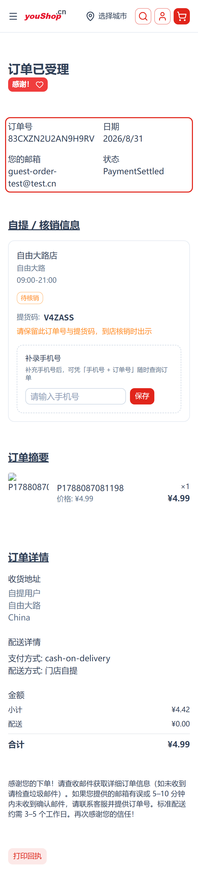

> 订单已受理，展示提货码与保留提示；下方为补录手机号卡片（含保存按钮）。

#### ② /order/lookup 成功查询（订单概览 + 提货码 + 自提点 + 商品明细）

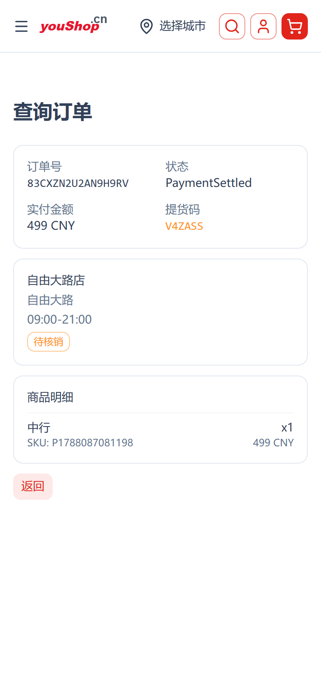

> 输入手机号 + 订单号后命中订单：订单概览、提货码、自提点与商品明细。

#### ③ 补录保存后（手机号已保存成功提示）

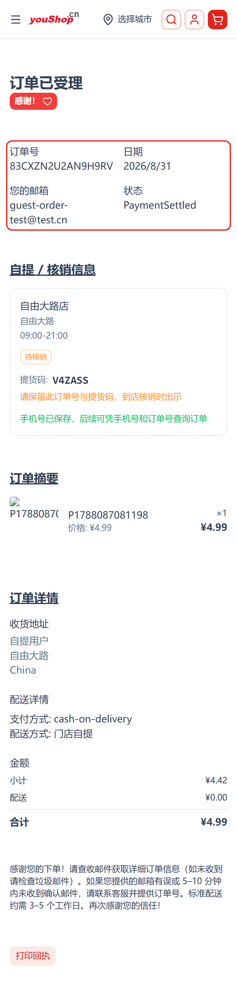

> 补录保存成功后卡片切换为「手机号已保存」，回到查询页可凭手机号 + 订单号命中订单。

### 6.5 后端 Shop API 入口

| 类型 | 入口 | 说明 |
|------|------|------|
| Query | `guestOrderLookup` | 游客凭「手机号 + 订单号」查询订单脱敏概览 |
| Mutation | `guestSetOrderCustomFields` | 补录订单自定义字段（如手机号） |

> 相关实现位于 pickup-plugin 的 `pickup-guest-order` resolver。

---

## 7. 订单核销码

平台新增「订单核销码」能力：C 端已登录用户可在订单详情查看本单核销码 + 二维码；管理端通过 `/admin/redemption` 手动/扫码输入核销码完成到店核销。核销码由 **cjk-plugin** 的 redemption 模块提供，前端核销页在前端 **nshop**（Nuxt）实现。

### 7.1 功能说明

| 能力 | 说明 |
|------|------|
| C 端查看核销码/二维码 | 已登录用户进入订单详情（`/account/orders/{code}`），订单模块内展示「核销码」卡：6 位核销码 + 二维码（qrPayload）+ 待核销/已核销徽标 |
| Code128 一维条码 | C 端核销码卡同时渲染 Code128 一维条码（`RedemptionCodeBar` 组件），可直接被门店扫码枪/条码扫描器识别，复用既有扫码设备，无需新增 App |
| 管理端手动/扫码核销 | 管理端核销页 `/admin/redemption` 提供核销码输入框（扫码枪键入后回车即触发查询），命中订单后展示订单概要 + 核销状态，一键「确认核销」 |
| Admin token 复用 | 管理核销页复用后端 Admin GraphQL 会话 token（`vendure-auth-token`），前端存 `sessionStorage`，每请求带 `Authorization: Bearer <token>` 打到 admin-api（`redemptionLookup`/`redemptionClaim`） |
| 多租户隔离 | `redemptionLookup`/`redemptionClaim` 按当前请求 Channel 归属检索 `redeemCodeHash`，保证核销码仅在本租户 Channel 内可查可核，不会跨租户串单 |

### 7.2 使用流程

```
C 端用户（已登录）
    └─ 订单详情 /account/orders/{code}
        └─ 核销码卡：展示 6 位核销码 + 二维码 + Code128 条码 + 待核销徽标
                │
管理端核销
    ├─ 进入 /admin/redemption
    ├─ 录入/粘贴 Admin token（或账号密码登录取 token）
    ├─ @ 输入核销码（手动键入，或扫码枪聚焦输入框后回车）
    ├─ redemptionLookup 命中订单 → 展示订单概要 + 核销状态
    └─ 点击「确认核销」→ redemptionClaim → 更新为已核销（含核销时间）
```

### 7.3 操作步骤

**C 端查看核销码**
1. 已登录用户进入「我的订单」列表（`/account/orders`），点击任一订单进入详情。
2. 详情页「核销码」卡展示 **6 位核销码 + 二维码 + Code128 一维条码 + 待核销（或已核销）徽标**。
3. 到店出示核销码/二维码/条码任一形态均可核销。核销码为按需生成：首次查看时后台幂等生成并加密存储。

**管理端核销**
1. 进入 `/admin/redemption`。
2. 在「管理令牌」区粘贴既已持有的 `vendure-auth-token` 并「保存」；或用后端管理员账号密码点「获取 Token」自动取 token（前端存 `sessionStorage`）。
3. 将扫码枪对准 Code128 条码（或手动输入核销码），聚焦输入框后键入并回车触发查询。
4. 命中订单后展示订单号、状态、数量/金额、核销状态；点击「确认核销」完成核销，页面回显新核销时间，核销状态变为「已核销」。
5. 下一单：核销完成后点击「操作下一单」清空输入继续。

> 说明：C 端订单详情与列表均在 `www` 域（shop-api）；管理核销页 `fetch` 跨域到 admin-api（`e.joho.cn`）。后端已就 www 域开放 CORS 并将 `vendure-auth-token` 暴露给前端读取（见下方接口表）。

### 7.4 界面截图（手机端验证）

#### ① 订单列表·卡片式（卡片 + 状态徽标 + 操作）

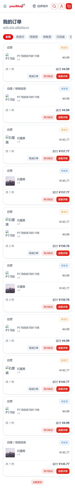

> 我的订单以卡片式展示：卡片内含订单号、商品、状态徽标与操作入口。

#### ② 订单详情·核销码卡（核销码 + 二维码 + 自提卡）

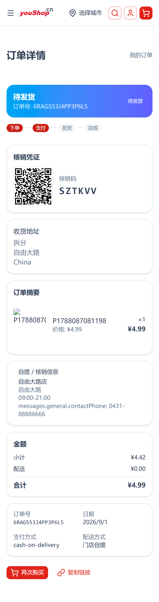

> 订单详情积木化布局：「核销码」卡展示 6 位核销码 + 二维码 + 待核销徽标，下方为收货/自提信息卡。

#### ③ 管理端核销页

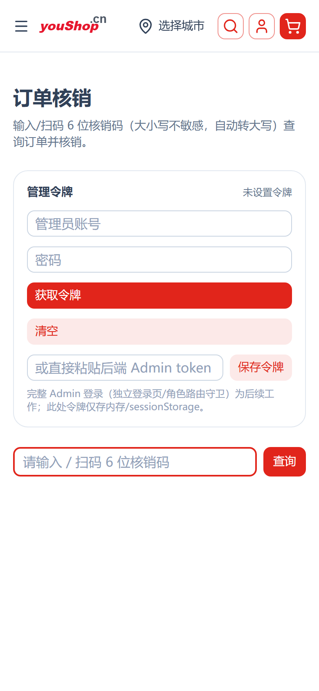

> `/admin/redemption`：顶部为「管理令牌」区（账号密码取 token / 粘贴 token），下方为核销码输入框（复用扫码枪回车触发查询）。

#### ④ 管理端核销·有效态（输入核销码查询命中）

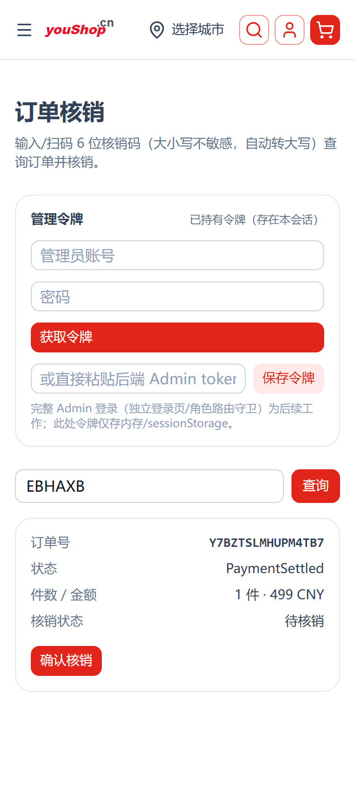

> 注入管理 token 并输入真实核销码后进入**有效态**：核销状态徽标显示「待核销」，并带出订单摘要（订单号、件数/金额、核销状态）；下方为「确认核销」按钮（点按触发 `redemptionClaim`）。

### 7.5 后端接口

**Shop API（C 端，同源 `www` 域）**

| 类型 | 入口 | 说明 |
|------|------|------|
| Query | `orderRedemptionCode(input:{ orderCode, phone? })` | 已登录用户 / 凭手机号访问本单核销码：返回 `redemptionCode`、`qrPayload`、`barcodePayload`（Code128）、`claimed`、`canAccess` |

**Admin API（管理端，`e.joho.cn/admin-api`）**

| 类型 | 入口 | 说明 |
|------|------|------|
| Query | `redemptionLookup(code)` | 按核销码在当前 Channel 检索订单，返回订单概要 + 核销状态（权限 `UpdateOrder`） |
| Mutation | `redemptionClaim(code)` | 按核销码核销订单，置为已核销并记录时间（权限 `UpdateOrder`） |

> 相关实现位于 cjk-plugin 的 redemption 模块（`redemption.resolver.ts` / `redemption-code.service.ts`）。核销码加密存储（`redeemCodeCipher`/`redeemCodeIv`/`redeemCodeHash`），生产依赖运维注入 `REDEMPTION_KEY`。

---

## 8. 订单详情 · 京东积木版式（四级可回退风格体系）

订单详情页已接入与商品详情页一致的四级可回退风格体系。渲染由前端 **nshop** 的 `OrderDetailRenderer` 承担：按 Channel 自定义字段 `orderDetailConfig.layout` 动态选择版式，逐块拼装。

### 8.1 版式与回退说明

| 项 | 说明 |
|----|------|
| 默认版式 | `jd`（京东积木版式）：由 `OrderDetailStatusBlock` / `Progress` / `Redemption` / `Address` / `Items` / `Pickup` / `Totals` / `Meta` / `Actions` 等块**搭积木**拼装，逐一卡片化展示 |
| 备用版式 | `classic`（经典版式）：旧版固定区块结构，配置回退兜底 |
| 缺省回退 | 后端未配置 `orderDetailConfig` / 配置为坏 JSON / layout 非法时，前端**缺省回退 `jd`**，不会白屏 |
| 块级定制 | 每块可通过 `blocks[key].visible/title/text` 定制显隐与文案，逐级兜底（块定制 → 块内建 → 全局默认） |
| 配置来源 | `GetChannelTheme.activeChannel.customFields.orderDetailConfig`（Channel 级，租户隔离） |

### 8.2 后台配置示例（Channel 自定义字段 `orderDetailConfig`）

```json
{
  "version": 1,
  "layout": "jd",
  "blocks": {
    "items": { "visible": true, "title": "商品清单" },
    "totals": { "visible": true }
  }
}
```

> 将 `layout` 改为 `"classic"` 可切回旧版固定版式（备用模板）。

### 8.3 界面效果（手机端验证，默认 `jd` 版式）

#### ① 订单列表 · 卡片式

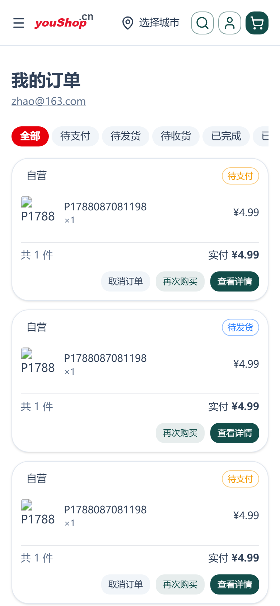

> 我的订单卡片式列表（订单号 / 商品 / 状态分卡）。

#### ② 订单详情 · 京东积木版式（默认，含核销码卡 / 地址 / 自提 / 金额 / 元信息块）

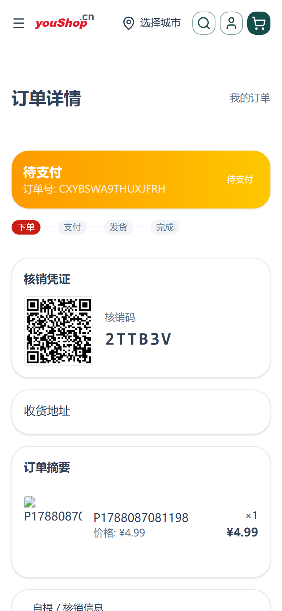

> 默认 `jd` 版式：顶部订单状态+进度、核销码卡（核销码 + 二维码 + 待核销徽标）、收货地址卡、商品摘要卡、自提核销卡、金额段（小计/配送/合计）、订单元信息卡、售后操作入口，全部卡片化积木拼装。

### 8.4 后端字段

| 字段 | 类型 | 说明 |
|------|------|------|
| `orderDetailConfig` | text (public) | 订单详情版式 JSON（结构见上） |
| `orderListConfig` | text (public) | 订单列表版式 JSON（本期仅卡片 `card`） |

> 两字段由 `packages/dev-server/dev-config.ts` 注册为 Channel 自定义字段，Vendure 启动时自动创建数据库列（`synchronize:true`），无需手写 migration。

---

## 9. 到店自提核销与收款

到店自提单支持**两种收款形态**。系统以「是否已收款」为唯一事实来源，区分线上支付与到店付款，并在核销/发货环节做**防漏收**约束。收款状态由 vendure 的 **pickup-plugin** 承载，核销页在前端 **web-admin**（uni-app H5）实现。

### 9.1 两种收款形态

| 形态 | 识别依据 | 收款时机 |
|------|---------|---------|
| 线上支付 | 订单支付方式为余额/在线支付等（非到店收银） | **下单即已收款**，`collected` 恒为 true（online 判定） |
| 到店收款 | 订单支付方式为货到付款（`cash-on-delivery`）或固定聚合码收款（`fixed-aggregate-collection`） | **提货当刻由店员确认收款**，`collected` 由人工确认 |

> 实现：`pickup.service.ts` 的 `ARRIVE_STORE_PAYMENT_METHODS` 将上述两种支付方式统一识别为「到店收银」（下单当下未收款）。收款判定唯一真源为 `effectiveCollected = (paymentType === 'online') || collected`——online 恒视为已收款，`collected` 只存人工确认，避免历史数据回填偏差。

### 9.2 防漏收设计

- **到店收款单必须确认收款后才能核销**：店员核销 `claimPickupByShop(code)` 时，若订单为到店付款且 `collect !== true`，后端返回「该单为到店付款，请先确认收款后再核销」并拒绝核销。
- **顾客自核销仅限线上已收款单**：到店付款单不能通过 C 端自助核销，必须到店由店员收款并核销（`claimMyPickup` 拦截）。
- **发货环节依据收款状态**：核销即视为收款确认，`collected` 落库，为发货是否收费提供依据，并防止「忘记收款」的漏收风险。

> 简单提货规则：**“收款”与“核销”被绑定为同一动作**——店员点击核销即确认收款；到店付款单若未确认收款，核销会被系统拦截，从流程上杜绝漏收。

### 9.3 核销入口

管理端进入**到店自提核销**页（web-admin `/pages/pickup/redeem`），支持两种方式录入核销码：

1. **扫一扫**：点击「扫一扫」按钮，复用 `scanner.ts` 调起摄像头扫码（H5 `getUserMedia` / 小程序 `uni.scanCode` / 微信浏览器自动回落）。识别二维码或一维码，命中后自动核销。
2. **手动输入**：在核销码输入框键入 6 位核销码（大写字母+数字，排除易混字符），点击「核销」。

核销页下方「待核销自提单」列表，逐条展示：核销码、订单号、状态徽标，以及**收款状态**（`待到店收款 / 已收款`），店员可据此核对是否已收款。

> 属店过滤：待核销清单只展示**本店可核销**的自提单（订单含本店商品，判据与「本店商品单」一致）。本店在默认商城渠道售出、且走自提的自提单，同样会出现在本店待核销清单并可扫码核销；其它店商品的自提单不会串到本店列表。

### 9.4 界面截图（手机端验证）

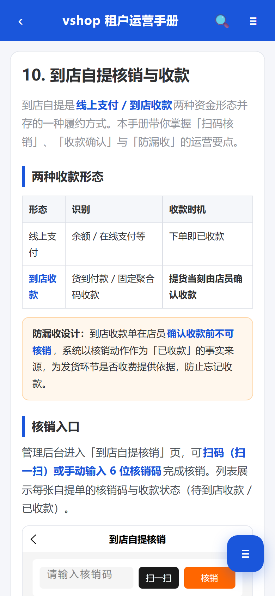

> 核销页：核销码输入框 + 「扫一扫」 + 「核销」按钮；下方「待核销自提单」列表展示核销码 / 订单号 / 收款状态（待到店收款 / 已收款）。

### 9.5 后端接口

| 类型 | 入口 | 说明 |
|------|------|------|
| Mutation | `claimPickupByShop(code, collect?)` | 店员核销；到店付款单必须 `collect=true` 才放行，跨店抛 `Forbidden` |
| Mutation | `claimMyPickup(orderId, code)` | 顾客自核销；到店付款单拦截 |
| Query | `myPickupOrders(options)` | 本店待核销清单（按订单商品 `shopId` 属店过滤） |
| Query | `myPickupCode(orderId)` | C 端查询本单核销码与支付类型 |

> 相关实现位于 pickup-plugin 的 `pickup.service.ts` / `pickup-owner.resolver.ts`。核销码为按需生成、加密存储。

---

## 10. 本店商品单（跨渠道商户订单可见性）

当商户商品在**默认商城**（default Channel）售出时，订单归属**默认商城渠道**，商户在自己的 Channel 后台用「本店渠道单」看不到这些订单。为让商户看清**自己卖出的所有订单**，web-admin 订单列表提供「本店商品单」维度，按商品 `shopId` 跨渠道归集（与 pickup/settlement 同判据）。

### 10.1 双维度口径

| 维度 | 口径 | 场景 |
|------|------|------|
| 本店渠道单 | 订单绑定当前 Channel（伴 `vendure-token` 路由） | 在本店独立 Channel 下产生的订单 |
| 本店商品单 | 订单**任一行商品**的 `Product.customFields.shopId` 归本店，跨渠道归集 | 含在**默认商城**等其它渠道售出的本店商品订单 |

> 判据实现：`orderLineHasShop(line, shopId)` —— 订单行商品 `productVariant.product.customFields.shopId === shopId`。本店商品单与到店核销、按店拆账使用**同一套商品归属判据**，保证「看得见」与「可核销」的订单集合一致。

### 10.2 操作步骤

1. 商户登录 web-admin，进入 **订单** 列表。
2. 顶部「本店渠道单 / 本店商品单」切换，选择 **本店商品单**。
3. 列表展示本店在全部渠道卖出的商品订单（含默认商城售出的单），可按订单号/顾客搜索、按状态筛选。
4. 若订单为自提单且已越过支付结算/履约发货，可在**核销**页按本店核销流程（见第 9 章）收款并核销。

### 10.3 界面截图（手机端验证）

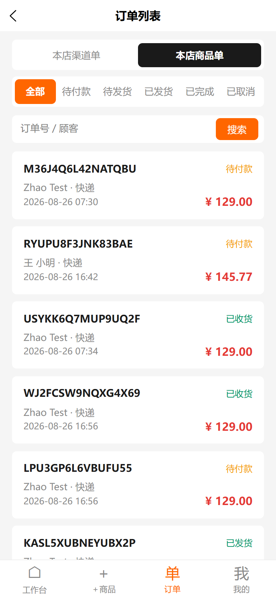

> 订单列表顶部「本店渠道单 / 本店商品单」切换，当前选中「本店商品单」：展示本店在全部渠道（含默认商城）售出的商品订单。

### 10.4 后端接口

| 类型 | 入口 | 说明 |
|------|------|------|
| Query | `myShopOrders(options)` | 本店商品订单（跨渠道按商品 `shopId` 归集） |

> 相关实现位于 shop-plugin 的 `merchant-resolver.ts` + `shop.service.getMyShopOrders`。web-admin 复用该接口实现「本店商品单」维度。
